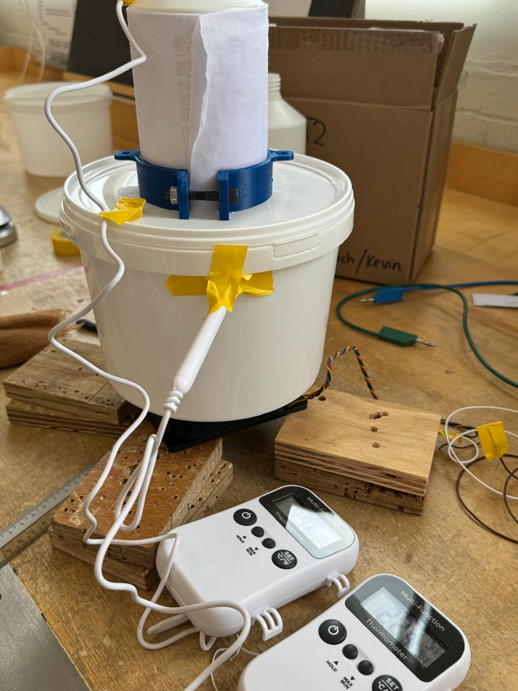
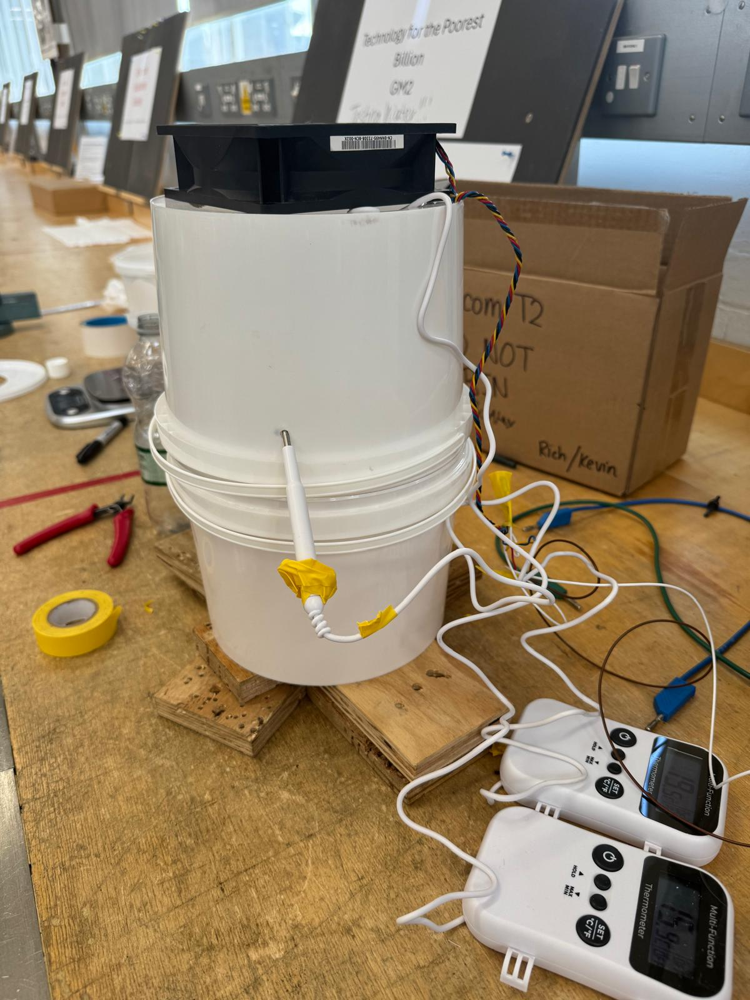
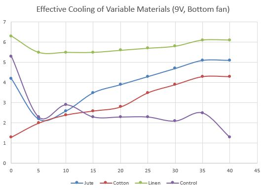
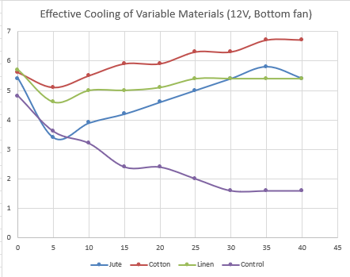
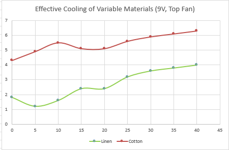

# Evaporative Cooling T2 Experimental Testing
**Summary:** My role focuses on designing, building, and testing an evaporative cooling system for Majicom's solar-powered water purification kiosk. The aim is to keep purified water cool post-filtration, particularly in hot off grid environments like Tanzania, where both energy and material resources are limited.
## **End goal:**
- Identify the **most effective, low-cost, material-airflow combination** for evaporative cooling with **minimal water and power use**.
- Prepare implementation proposal for **real-world kiosk integration**

<!-- I have selected sustainable materials, designing the experimental setup, and building a testing framework to compare passive and fan-assisted evaporative cooling performance. I’ve also developed a detailed **risk assessment** to ensure safety throughout testing. -->

<!-- While T1 is exploring a **heat pump-based system**, our work focuses on an **assisted passive cooling solution** that avoids high power demands. This approach could operate independently or in parallel with active systems, offering a more affordable and energy-efficient alternative. -->

---

## Experimental Method

To test evaporative cooling performance, a developed **controlled model** is used:

- 1L plastic bottles (representing kiosk containers)
- A small 3–5L bucket acting as an airflow chamber
- Fabric materials soaked and wrapped around each bottle
- PC fans (~12V) to generate controlled airflow

The fan is placed **5–10 cm away** from the bottle to ensure measurable airflow across the surface. The bottle is suspended inside the bucket secured by a 3D printed clamp or placed centrally to standardise airflow exposure. We are also using cold tap water to mimic the temperature they could get in Tanzania (around 15 degrees).

### Why This Model?

- Represents the **scale and shape** of real-world water containers
- Easy to replicate for multiple material and fan configurations
- Allows us to **control parameters** such as airflow speed, fabric type, thickness, and ambient conditions

## Materials Selection

Three core fabrics were selected based on **availability, fibre porosity, and capillary action**:

| Material | Rationale |
|----------|-----------|
| **Cotton** | High absorption, good wicking, easy to wrap tightly |
| **Linen** | Excellent evaporation due to flax fibres, durable |
| **Jute** | Coarse but retains water well, tested for feasibility |

Each material was wrapped in **1 or 2 layers** depending on thickness (2mm), and soaked for 5 minutes before testing. Some fabrics like bamboo viscose were excluded due to procurement difficulty.

## Measurements 

For each trial, I recorded the following:
- *Fabric wet and dry weight* — to measure how much water is retained initially and track drying.
- *Water temperature in bottle (°C)* — to assess cooling effectiveness over a fixed period.
- *Ambient temperature* — to contextualise thermal gradients and allow comparison across trials.
- *Time elapsed — standardised* (e.g. 40 min) for fair comparison.
- *Water mass loss* — to evaluate evaporation rate directly to fit numerical model.
  
 *Using ΔT = T_ambient - T_bottle is critical*
 
We focus on the temperature differential between the ambient environment and the cooled bottle because:
A larger ΔT (larger drop in bottle temp relative to air) indicates more effective evaporative cooling.
It allows us to standardise cooling effectiveness across varying room temperatures, which is especially relevant for future outdoor testing.

This directly maps to thermal modelling inputs: the numerical model Alex is developing simulates heat flux balance across the bottle surface, where ambient air temp is a boundary condition and fabric-induced cooling affects surface heat transfer coefficients.

<!-- By linking the experimental ΔT results to modelled heat loss, we validate assumptions such as convective coefficients, evaporation rate constants, and the influence of airflow velocity on surface cooling. These measured values provide grounding for refining the numerical simulation of real kiosk conditions. -->

## Analysis 

- Fan speed and position matter:
12V > 9V — higher airflow gave better cooling.
Bottom fans worked better than top fans, likely due to better contact with wet fabric.

- Linen performed best:
Fastest and most sustained cooling across trials. High breathability + quick drying.

- Cotton was decent:
Improved with airflow, especially under top fan. Good absorption, moderate evaporation.

- Jute was slow but steady:
Retained more water, cooled slowly. Less effective in short trials but potentially better for long-term cooling.

- Control (no fabric):
Heated up over time — proves that airflow alone isn't enough without evaporation.

## Next Steps

This impacts testing going forward by helping us narrow down variables and focus on what works best:
We'll prioritise linen as the main material since it showed the strongest cooling.
We'll now test one more fan position (two fans controlling airflow from the side), speed and possibly multi-layer fabric setups to fine-tune performance, and choose the optimal parameters.
These results also let us calibrate the numerical model more accurately, so future testing can be more predictive and less trial-and-error.

---
## Expected Discrepancies with Numerical Model
- Environmental factors: Ambient humidity and airflow in real settings vary, unlike ideal model assumptions.
- Material inconsistencies: Natural fabrics (like jute or linen) may have uneven porosity or thickness, affecting evaporation.
- Heat losses: Model may not fully capture heat exchange through the bottle cap or sides not covered in fabrics.
- Evaporation rate constants: Experimental values may differ due to wind turbulence and fabric saturation limits.
  
## Risk Assessment Summary
- Electrical safety: Low-voltage (12V) fans minimise risk, but all wiring is kept insulated and secured.
- Water handling: Spills are contained; equipment is elevated to avoid contact.
- Sharp tools: Used for cutting bottles/buckets—handled with care and PPE.
- Trip hazard: Cables and fan mounts secured to prevent accidents.

## Fabric Selection Summary

| **Fabric**             | **Category**           | **Reason to Test**                        |
|------------------------|------------------------|-------------------------------------------|
| 100% Cotton (baseline) | Natural                | Standard wicking benchmark                |
| Jute / Burlap          | Natural (coarse weave) | Slow evaporation, retains dampness longer |
| Bamboo Viscose         | Natural/Processed      | Superior absorption, soft & breathable    |
| Linen                  | Natural (flax)         | Cool feel, fast drying                    |
| Microfibre Suede       | Synthetic              | Strong cooling, dries quickly             |
| Coolmax / Sports Fabric| Synthetic (technical)  | High-performance wicking benchmark        |

---

## 📦 Materials List for Testing

| **Item**                              | **Qty** | **Purpose**                                              | **Estimated Cost** | **Notes / Sourcing**                            |
|---------------------------------------|--------|-----------------------------------------------------------|---------------------|-------------------------------------------------|
| 1L Plastic Bottles                    | 6–8    | Identical containers for consistent testing               | £5–10               | Reuse soda bottles or order multipack           |
| 100% Cotton Fabric (~150–250 GSM)     | 1 m²   | Baseline material – natural, breathable, good absorption  | £3–5                | Fabric shop or Amazon                           |
| Jute / Burlap Fabric (~200 GSM)       | 1 m²   | Coarse weave – long-lasting dampness                      | £3–5                | Gardening stores or eBay                        |
| Bamboo Viscose (~180–220 GSM)         | 1 m²   | High absorption, soft feel, potentially best performer     | £5–7                | Bamboo muslin or towel fabric                   |
| PC Case Fans (80–120mm, 12V)          | 2–3    | Create airflow over fabric surface                        | £5–8 each           | Amazon, PC hardware suppliers                   |
| 12V DC Power Supply or Fan Controller | 1      | Allows control of airflow speeds                          | £8–12               | PSU, voltage regulator, or fan speed dial       |
| Optional: Battery Pack (8x AA)        | 1      | Portable power source for fans (optional)                 | £5–8                | Only for non-mains setups                       |
| Cotton Rope / Wick Cord               | 1–2 m  | Passive water delivery system from reservoir to fabric    | £2–4                | Garden centre or Wilko                          |
| Water Reservoirs (500mL–1L)           | 2–3    | Maintain rewetting of fabrics                            | £2–4                | Reuse bottles or food containers                |
| Basic Digital Thermometer             | 2–3    | Manual temp readings (internal bottle temp)               | £5–7 each           | Waterproof kitchen or aquarium thermometer      |
| Digital Kitchen Scale (0.1g)          | 1      | Measuring evaporative water loss (fabric mass change)     | £10–15              | Amazon or Argos                                 |
| Scissors / Craft Knife                | 1      | Cutting fabric to standard dimensions                     | £2–3                | Any stationery or lab supply                    |
| Tape / Velcro / Elastic Bands         | 1 set  | Secure fabric onto bottle surface                         | £2–5                | General use                                      |
| Plastic Buckets or Boxes (6–10L)      | 2–3    | Create semi-enclosed airflow chamber for fan testing      | £6–10 each          | IKEA SAMLA, B&Q, Wilko                          |

---

